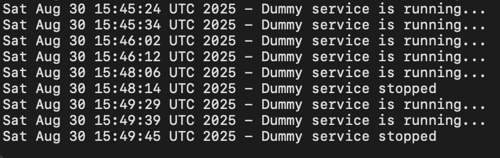

# dummy-systemd-service
Project from [roadmap.sh](https://roadmap.sh/projects/dummy-systemd-service) when you have to make a basic systemd service.

The goal is to make a `dummy.sh` script that writes a message every 10 seconds to a log file in `/var/log`.

## Setup
For this project, I will make two shell scripts for the *dummy* service instead of one script. The two scripts will be named `dummy-start.sh` and `dummy-stop.sh`.

You can create the files in any location, but I created them in `/usr/bin`.

### Creating scripts
#### dummy-start
I copied the script from the project template and added a timestamp every time we write to the log file.

This file will write every 10 second a timestamp in `/var/log/dummy-service.log` if the  *dummy* service is running.

```bash
#!/bin/bash

while true; do
  echo "Dummy service is running..." >> /var/log/dummy-service.log
  sleep 10
done
```

#### dummy-stop
This file prints a timestamp in `/var/log/dummy-service.log` if the *dummy* service is stopped and specifies it as well.
```bash
#!/bin/bash

echo "$(date) - Dummy service stopped" >> /var/log/dummy-service.log
```

Make sure your scripts are executable.
```bash 
sudo chmod +x /usr/bin/dummy-start.sh /usr/bin/dummy-stop.sh
```

### systemd service file
Browse to `/usr/lib/systemd/system` and create a new file called `dummy.service`. 

Open a text editor to add content

``` bash
sudo nano ./dummy.service
```

Add the following content.

Notice that in the [Service] section we have two entries:
* `ExecStart=` is when we start the service
* `ExecStopPost` is executed after the service is stopped

The [Install] section tells *systemd* when to start the service in the boot process. `multi-user.target` is a state used for non-graphical user sessions and common for custom services. Further reading can be found [here](https://www.baeldung.com/linux/systemd-target-multi-user).

```
[Unit]
Description= dummy service

[Service]
ExecStart=/usr/bin/dummy-start.sh
ExecStopPost=/usr/bin/dummy-stop.sh

[Install]
WantedBy=multi-user.target
```

Save the file and perform the following commands:

``` bash
# Starting dummy service
sudo systemctl start dummy

# Stopping dummy service
sudo systemctl start dummy

# Disabling dummy service
sudo systemctl disable dummy

# Enabling dummy service
sudo systemctl enable dummy

# Dummy service status
sudo systemctl status dummy

# View ctl logs
sudo journalctl -u dummy
```

You can browse to `/var/log/dummy-service.log` to view if the two scripts are working:




